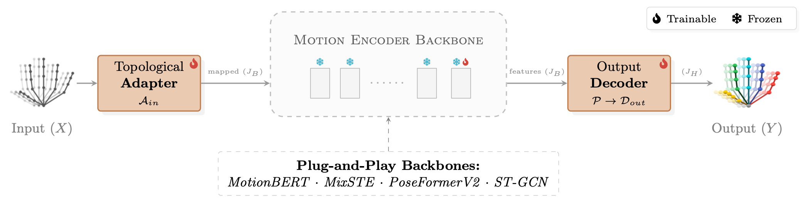

# TransHands: Repurposing Human Pose Encoders as Hand Pose Encoders.

OFFICIAL IMPLEMENTATION of the paper **TransHands: Repurposing Human Pose Encoders as Hand Pose Encoders**.

> **Abstract:** Lifting 3D hand poses from 2D monocular representations remains challenging due to the limited availability of large-scale, diverse 3D-annotated hand datasets, in contrast to the abundance of human body motion data. We address this limitation by transferring motion representations learned from large body pose corpora to the hand domain.
We introduce **TransHands**, a backbone-agnostic transfer learning framework that enables pre-trained human motion encoders to be effectively adapted for 3D hand pose estimation from 2D pose inputs. Rather than training hand-specific biomechanical models from scratch, TransHands combines a two-stage training and fine-tuning strategy with a lightweight hand-specific input adaptation module that aligns hand kinematics with the representation space learned for full-body motion.
We evaluate TransHands across four state-of-the-art motion modeling architectures, including transformer-based, graph-based, and frequency-domain models. Results demonstrate that motion priors learned from body pose data transfer consistently across architectures, yielding consistent accuracy gains, strong cross-domain generalization, particularly in challenging egocentric settings, and applicability for downstream tasks in real-world contexts.

## Architecture


We support plug-and-play integration with the following Motion Encoder Backbones:
- **MotionBERT** (DSTformer)
- **MixSTE** (Seq2Seq)
- **PoseFormerV2** (Frequency Domain)
- **ST-GCN** (Graph Convolution)

## Setup

### Environment
Tested with **Python 3.10** and **PyTorch 2.1.0 (CUDA 12.1)**.
Dependencies are pinned in [requirements.txt](requirements.txt).

### Prepare Data & Encoders
Please, refer to documentation for dataset organization and backbone downloads:
- [Datasets Documentation](docs/datasets.md).
- [Encoders Documentation](docs/encoders.md).

#### Suggested Directory Structure
The repository is organized as follows:
```bash
TransHands/
├── configs/          # Configuration files for all stages (1, 2-A, 2-B) and Downstream Task (Gesture)
├── dataset/          # Root directory for datasets
├── docs/             # Documentation and assets
├── experiments/      # Training outputs (checkpoints and plots)
├── external/         # Root directory for backbones
├── src/
│   ├── data/         # Data loading and augmentation
│   ├── models/       # Model architecture
│   └── training/     # Loss functions
├── tools/            
│   ├── data_prep/    # Scripts to prepare and extract dataset keypoints
│   ├── gesture/      # Gesture recognition scripts
│   └── lifting/      # 3D pose lifting scripts
└── requirements.txt
```

## Usage

### Training
Our training pipeline follows the Transfer Protocol described in the paper.

#### Stage 1 (Alignment)
In this phase, the backbone Motion Engine is kept frozen. We train only the Topological Input Adapter and the Projection Head.

```bash
# Example of training on Re:InterHand (Stage 1) and enabling the L-MMM with MotionBERT
python tools/lifting/train.py \
    --config configs/lifting/MotionBERT/motionbert_stage1.yaml \
    --use-lmmm
```

#### Stage 2-A (Refinement)
We selectively unfreeze the backbone and enable L-MMM.
```bash
# Example of resuming from Stage 1 with MotionBERT
python tools/lifting/train.py \
    --config configs/lifting/MotionBERT/motionbert_stage2a.yaml \
    --resume experiments/lifting/MotionBERT/motionbert_stage1/best.pth
```

> **Note:** The flag `--use-lmmm` activates the **Lifting Masked Motion Modeling (L-MMM)**

#### Stage 2-B (Generalization)
Training on the combined dataset (AssemblyHands + GigaHands) with balanced sampling.
```bash
# Example of resuming from Stage 2-a and enabling balanced sampling with MotionBERT
python tools/lifting/train.py \
    --config configs/lifting/MotionBERT/motionbert_stage2b.yaml \
    --resume experiments/lifting/MotionBERT/motionbert_stage1/best.pth \
    --balanced-sampling
```

Main Training Options: 
* `--resume <checkpoint_path>` -> Resume training from a saved checkpoint.
* `--use-lmmm` -> Enable Self-Supervised Masked Modeling loss for lifting task (L-MMM). 
* `--balanced-sampling` -> Enable Balanced Sampling for multidataset training. 

*Default loss is the supervised Weighted MPJPE loss.*

During training **checkpoints** are automatically saved in the directory specified in the config file.  

#### Training Evaluation
To run the evaluation script:
```bash
python tools/lifting/test.py \
    --config <path_config_file> \
    --checkpoint <path_checkpoint> \
    --dataset <dataset_name> \
    --split val
```

*Supported datasets: `reinterhand`, `assemblyhands`, `gigahands`, `multi`.*

### Visualization
Generate visualizations (Ground Truth vs Predictions) and compute overall statistics:
```bash
python tools/lifting/visualize.py \
    --config <path_config_file> \
    --checkpoint <path_checkpoint>
```

Options:
* `--num-samples <n>` -> Number of samples to evaluate (Default is n=10).
* `--split <split>` ->  Dataset split to use (`train`, `val` or `test`) (Default is `val`).
* `--full-eval` -> Statistics report is computed for the full evaluation set before visualization.

Reports and visualizations are automatically saved in the directory specified in the config file.

### Downstream Task: Gesture Recognition
To demonstrate the robustness of the learned biomechanical priors, TransHands can be seamlessly adapted for gesture recognition tasks using the extracted 3D poses.

```bash
# Example of training on Jester with MotionBERT
python tools/gesture/train.py \
    --config configs/gesture/MotionBERT/motionbert_jester.yaml
```

#### Gesture Evaluation

To run the evaluation script:
```bash
python tools/gesture/test.py \
    --config <path_config_file> \
    --checkpoint <path_checkpoint> \
    --split val
``` 

## Model Zoo & Checkpoints

We provide pre-trained checkpoints for all four backbones, covering the three stages (**Stage 1**, **Stage 2-A**, **Stage 2-B**).
Each backbone archive is organized as a self-contained package, including:
- Pre-trained model weights (`.pth`) for each stage.
- The specific configuration file (`.yaml`) used for reproducibility.

#### [Download Checkpoints](https://www.kaggle.com/datasets/anonymtranshands/transhands)

### Archive Structure
Each backbone folder (e.g., `motionbert/`) follows this structure:
```bash
lifting/
└── motionbert/
    ├── checkpoints/
    │   ├── motionbert_s1.pth      # Stage 1: Alignment
    │   ├── motionbert_s2a.pth     # Stage 2-A: Refinement
    │   └── motionbert_s2b.pth     # Stage 2-B: Generalization
    └── configs/                   # Reproducibility configs (identical to the repo)
        ├── motionbert_stage1.yaml
        ├── motionbert_stage2a.yaml
        └── motionbert_stage2b.yaml
```